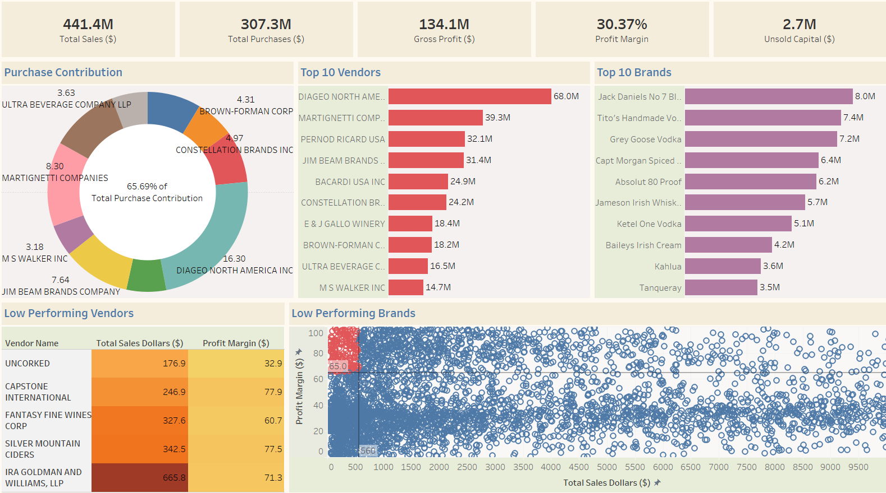

# Vendor-Perfomance-Analytics

## Overview
A comprehensive analytics pipeline that processes vendor transaction data, generates performance metrics, and provides actionable business insights through statistical analysis and visualization.

## Key Features
- **Automated data ingestion** from CSV to SQL database
- **Vendor performance metrics** calculation (profit margins, turnover ratios)
- **Statistical analysis** with confidence intervals and hypothesis testing
- **Tableau dashboard** for interactive visualization
- **Automated reporting** with professional visualizations

## Dataset

Dataset Link: https://www.kaggle.com/datasets/vivekkumarkamat/vendor-performance-analysis/data

## Component Descriptions

### Data Ingestion (`db_ingestion.py`)
- **Purpose**: Automated pipeline for loading raw vendor data into SQL database  
- **Functionality**:
  - Scans `data/` directory for CSV files
  - Creates corresponding tables in `inventory.db` (SQLite)
  - Logs all operations with timestamps
- **Input**: CSV files in `data/` directory  
- **Output**: SQL tables with raw vendor/purchase/sales data

### Vendor Summary (`get_vendor_summary.py`)
- **Purpose**: Transforms raw transactional data into actionable vendor performance metrics through a 3-stage process:
  1. *Data Cleaning*
      - Remove Inconsistencies and make datatype conversions, etc
  2. *Data Aggregation*
      - Merge 4 core tables: vendor_invoice, purchases, purchase_prices, and sales
  3. *Metric Generation*
      - Create new KPIs such as **Gross Profit**, **Profit Margin**, **Stock Turnover** and **Sales to Purchase Ratio**.
    
### Perfomance Analysis (`perfomance_analysis.ipynb`)
- **Purpose**: Business intelligence through statistical analysis
- Key Features:
  - Identifies high-potential/low-sales brands
  - Find the top vendors and top brands
  - Pareto analysis of vendor contributions
  - Bulk purchase optimization insights
  - Identify poor stock turnovers and unsold capitals
  - Hypothesis testing (95% confidence intervals)

 ## Tableau Dashboard



### Core Visualizations
  - Total Sales, Purchases, Gross Profit, Profit Margin % and Unsold Capital
  - Purchase Contribution of Top 10 Vendors
  - Top 10 Vendors
  - Top 10 Brands
  - Least Performing Vendors
  - Least Performing Brands that need Promotional or Pricing Boost

## Project Structure
```
Vendor-Perfomance-Analytics/
│
├── dashboard/
│ |── VendorPerformance.twb                            # Tableau dashboard file
| └── VendorPerfomanceDashboard.png                    # Screenshot of the dashboard
│
├── data/
│ └── vendor_sales.csv                                 # Final processed data
│
├── plots/
│ ├── brand-performance.png                            # Brand performance visualization
│ ├── confidence-interval-comparison.png               # Statistical comparison
│ ├── correlation-heatmap.png                          # Feature correlation matrix
│ ├── count-plot.png                                   # Categorical distribution
│ ├── distribution-plot.png                            # Numeric feature distributions
│ ├── outlier-plot.png                                 # Outlier detection
│ ├── top-10-vendor-purchase-contribution.png          # Pareto analysis for purchase contribution of top 10 vendors
│ ├── top-vendors_and_top-brands.png                   # Performance leaders
│ └── vendor-contribution-chart.png                    # Market share breakdown
│
├── scripts/
| ├── db_ingestion.py                                  # Data pipeline script
| ├── exploratory_data_analysis.ipynb                  # Exploratory Data Analysis and Data Cleaning
| ├── get_vendor_summary.py                            # Data Aggregation and summarization script
| └── perfomance_analysis.ipynb                        # Python Notebook for complete data and perfomance analysis
├──
├── LICENCE                                            # MIT Licence   
└── README.md
```
